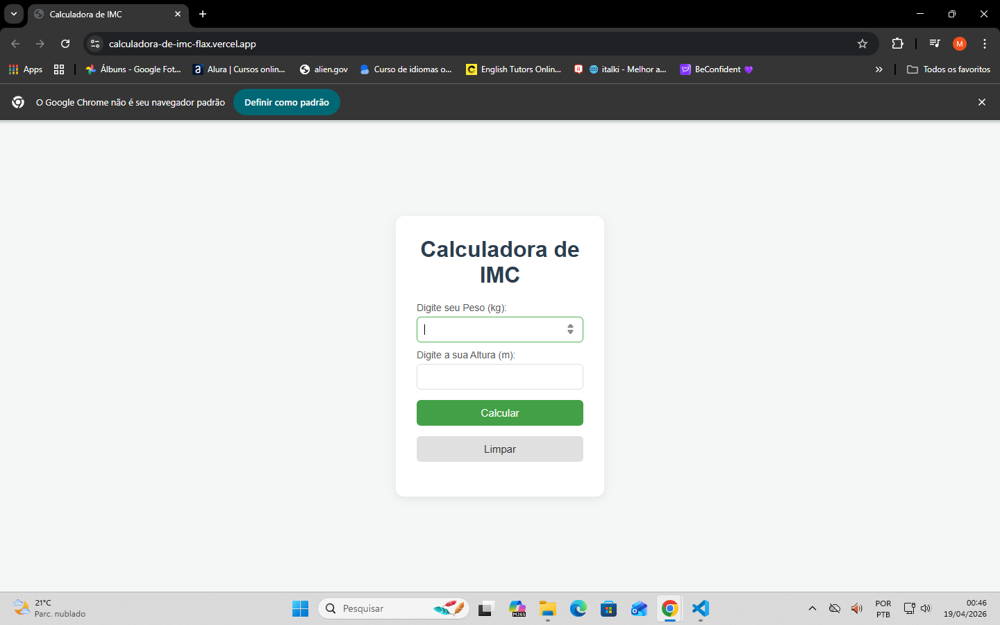
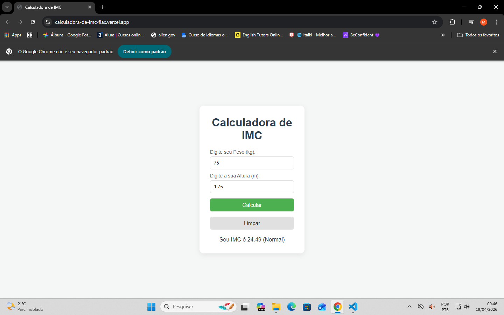

# 📊 Calculadora de IMC

Aplicação web para cálculo do Índice de Massa Corporal (IMC), com validação de dados, classificação automática e interface responsiva, desenvolvida com HTML, CSS e JavaScript, seguindo os padrões da Organização Mundial da Saúde (OMS).

---

## 📷 Preview

<p align="center">
  
  
</p>

---

## 🚀 Demonstração

🔗 **Acesse a aplicação:**  
https://calculadora-de-imc-flax.vercel.app/

---

## 📌 Funcionalidades

- Cálculo automático do IMC
- Validação de entradas (peso e altura)  
- Classificação automática conforme OMS
- Feedback visual para o usuário
- Interface simples e intuitiva
- Limpeza rápida dos dados

---

## 🛠 Tecnologias utilizadas

- HTML5
- CSS3
- JavaScript

---

## 🧠 Lógica do cálculo

O IMC é calculado com base na seguinte fórmula:

```
IMC = peso / (altura * altura)
```

Onde:

- O peso é em kg
- A altura é em metros

---

## 📱 Responsividade

O layout foi desenvolvido para funcionar em diferentes tamanhos de tela, proporcionando uma boa experiência tanto em desktop quanto em dispositivos móveis.

---

## 💡 Aprendizados

Durante o desenvolvimento deste projeto, foram aplicados conceitos como:

- Manipulação do DOM com JavaScript
- Validação de formulários
- Estruturação de funções
- Organização de código
- Estilização com CSS
- Boas práticas de usabilidade

---

## 📁 Como executar o projeto

1. Clone o repositório:

```
git clone https://github.com/MikaelCorreia/Calculadora-de-IMC.git
```

2. Abra o arquivo:

```
index.html
```

---

## 📄 Licença

Este projeto é de uso livre para fins de estudo.

---

## 👨‍💻 Autor

Desenvolvido por **Mikael Santos**

- GitHub: https://github.com/MikaelCorreia  
- LinkedIn: https://www.linkedin.com/in/mikaelcorreia1/
